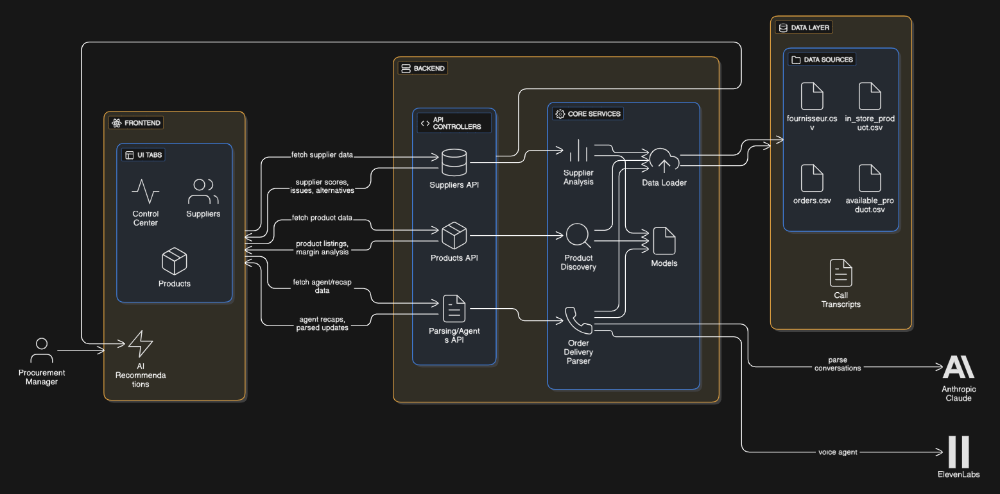

## Korius – AI Control Tower for Pharmacy Procurement

<video src="assets/video_demo.mp4" controls style="max-width: 100%; margin-top: 8px;">
  Your browser does not support the video tag.
</video>

**Korius** is an AI-powered control tower that automates supplier calls, price checks, and market catalog updates for pharmacies.  
It turns raw order and supplier data, plus external market product feeds, into **actionable recommendations** and **ready-to-execute tasks** for the procurement team.

Think of it as a **virtual sourcing analyst** that:
- Monitors supplier performance and margins in real time
- Detects cheaper alternatives across your supplier base
- Parses agent phone conversations to update ETAs and prices
- Surfaces prioritized recommendations in a clean, operator-first UI

---

## Description

Korius is a proactive AI control tower designed to **reduce procurement risk and cost** for pharmacies.  
Instead of manually calling suppliers, checking prices, and updating catalogs, buyers rely on AI agents that monitor the market, talk to suppliers, and surface the next best actions.

The system is built as a **hackathon-ready prototype** to showcase how AI can:
- Continuously compare in-store prices with market offers
- Parse supplier phone calls to keep ETAs and conditions up to date
- Highlight margin opportunities on everyday products
- Free up operators from repetitive, low-value follow-up work

**Target user**: Pharmacy or healthcare procurement manager who owns supplier relationships, margin, and purchasing budget.

---

## Overview

This AI-powered system augments a pharmacy’s purchasing workflow by combining:

- **Supplier and product analytics** over local CSV data
- **Market product and price comparison** to highlight cheaper or faster alternatives
- **AI transcript parsing** to turn unstructured calls into structured delivery and pricing updates
- **A control-center UI** that lets buyers see agent impact and act on recommendations in one place

The result is a **single pane of glass** for monitoring supplier performance, market offers, and open follow-ups.

---

## Features

### Control Center for Procurement Teams

- Dashboard that shows how many:
  - Delivery risks have been de‑risked by agents
  - Supplier follow-ups were sent automatically
  - Price checks were completed against current market conditions
  - New product matches were identified for existing needs
- Daily recap timeline with example transcripts so stakeholders can **see how the AI actually talks and reasons**.

### Supplier and Market Intelligence

- Supplier performance and margin analysis driven by:
  - Delivery performance (on-time vs late)
  - Price competitiveness across suppliers
  - Order volume and product diversity
- Market product listing from `available_product.csv` to:
  - Compare unit prices across suppliers
  - Identify cheaper or more reliable alternatives for in-store products
  - Quantify potential savings and margin uplift.

### AI Call & Transcript Parsing

- Uses Anthropic Claude to analyze **real call transcripts** between the pharmacy and suppliers.
- Extracts structured fields such as:
  - Updated estimated delivery dates
  - Delay/advance in days vs the original ETA
- Outputs machine-usable updates that can be applied back to `orders.csv`.

### Alerting & Recommendations

- AI Recommendations panel that adapts to the current tab (Control Center, Suppliers, Products).
- Suggestions include:
  - Switching supplier for specific molecules to save cost
  - Re‑contacting suppliers with poor reliability
  - Adjusting product mix based on demand patterns or market availability
- Each suggestion is actionable in the UI and designed to map to future **end‑to‑end workflows** (e.g., auto-adjusting orders, triggering negotiations).

---

## How It Works

1. **Data ingestion**  
   CSV files in `data/` (`fournisseur.csv`, `in_store_product.csv`, `available_product.csv`, `orders.csv`) are loaded and converted into typed models.

2. **Supplier and product analysis**  
   Backend services compute:
   - Cheaper alternatives for in-store products
   - Supplier performance and margin impact
   - Innovative products available in the market but not yet listed in store.

3. **AI agent conversations**  
   Phone calls with suppliers are transcribed into JSON files.  
   The `OrderDeliveryParser` service uses Claude to:
   - Read the transcript
   - Detect product-by-product delivery changes
   - Produce structured JSON with new dates and delays.

4. **Updates and insights**  
   Parsed outputs are applied back to orders and can update product metadata.  
   Aggregated metrics are exposed by FastAPI endpoints, consumed by the frontend via `src/lib/api.ts`.

5. **Buyer experience**  
   The React frontend renders:
   - A Control Center summarizing AI activity and sample transcripts
   - A Suppliers view showing performance, issues, and contact actions
   - A Products view focused on market listings and margin comparison
   - An AI Recommendations panel that surfaces the most impactful actions first.

---

## Key Benefits

- **Reduced manual follow-up**: AI agents and parsing pipelines handle day-to-day supplier calls and status checks.
- **Better margins with less effort**: Systematically highlights cheaper market alternatives and margin opportunities hidden in CSVs.
- **Fewer unpleasant surprises**: Parsed ETAs and delivery delays make risks visible early, so teams can act before stock‑outs.
- **Judge- and stakeholder-friendly UI**: Clear storytelling in the Control Center and Suppliers views, with realistic transcripts and metrics.

---

## Tech Stack

- **Frontend**: React + TypeScript + Vite + Tailwind CSS + shadcn-ui  
  - SPA hosted under `frontend/`  
  - Uses `@tanstack/react-query` for data fetching  
  - Talks to the backend at `http://localhost:8000/api/*`

- **Backend**: FastAPI (Python 3.10+)  
  - Lives under `backend/`  
  - Exposes REST endpoints for suppliers, products, and parsing pipelines  
  - Serves as the orchestration layer between:
    - Local CSV data (`data/` directory)
    - Analysis services (supplier performance and margin analysis, cheaper alternatives, product discovery)
    - Optional AI agents (Anthropic Claude, ElevenLabs) for call parsing

- **Data layer**: Ingested from CSVs under `data/`  
  - `fournisseur.csv`: suppliers  
  - `in_store_product.csv`: current catalog and prices  
  - `available_product.csv`: broader market/supplier universe  
  - `orders.csv`: historical and recent orders  
  - Transcript JSON files for example agent calls (in `data/transcripts/` and `transcripts/`)

---

## Next Steps

Natural next steps:
- Persist agent decisions back into a real ERP/inventory system.
- Extend the parsing pipeline to handle email threads and PDFs, not just call transcripts.
- Add role-based dashboards for finance, operations, and category managers.
